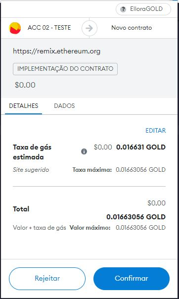

# SmartContract ERC20 Token
um projeto de contrato inteligente para Token Criptomoedas .
Funçoes de contrato: Transaçoes de criptomoeda 💢

## Tecnologias utilizadas
- Solidity.
- RemixIDE.
- Ganache.
- MetaMask.

